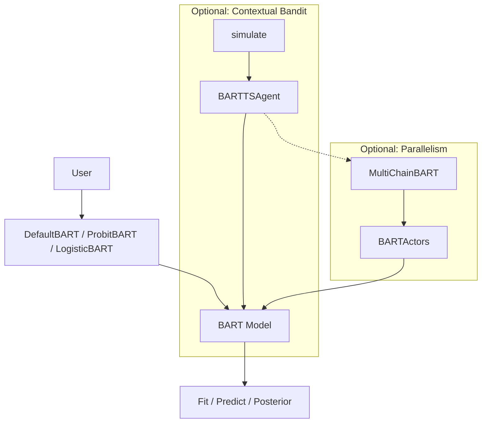
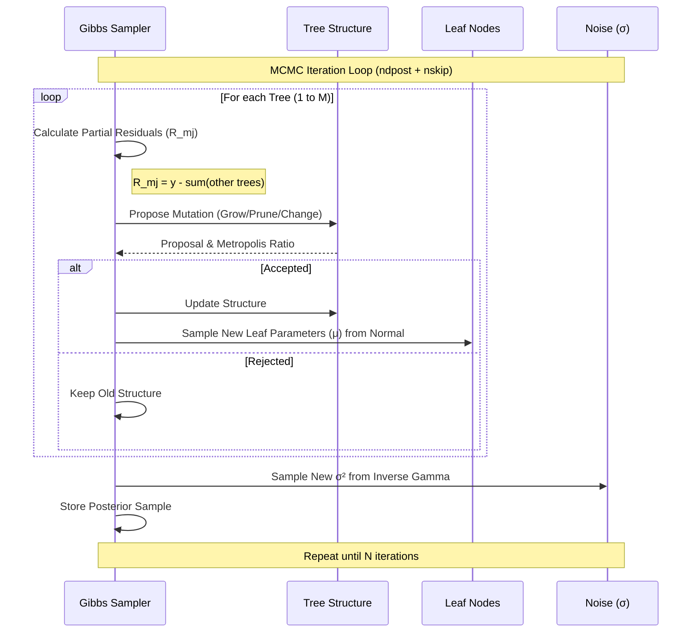
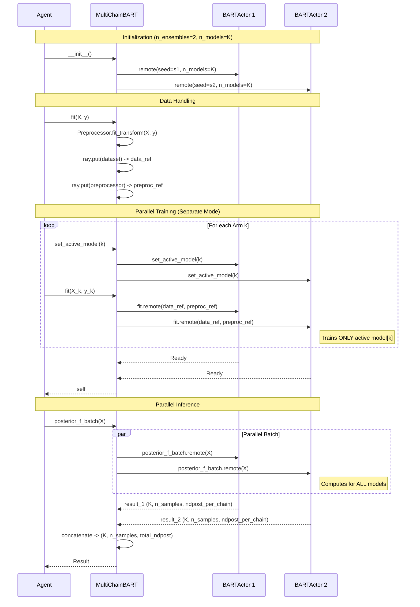

# bart-playground

A fast and modular implementation of Bayesian Additive Regression Trees (BART) for regression and classification tasks, with support for contextual bandits.

## Status

**⚠️ Experimental / Research Use Only**

This package is in early development and is **not production-ready**. The API is unstable and may change without notice. This software is provided for research purposes only.

## Installation


### Using pip (More Flexible)

Use this method to install with flexible version requirements:

```bash
pip install -e .
```

This installs the latest versions that satisfy the minimum requirements in [pyproject.toml](pyproject.toml), which should work but have not been extensively tested. 

###  Using Conda (For Reproducibility)

Use this method to install the exact dependency versions during development:

```bash
conda env create -f environment.yml
conda activate bartts
pip install -e .
```

## Quickstart

### Regression

```python
from bart_playground import DefaultBART, DataGenerator

# Generate synthetic data
X, y = DataGenerator(n_samples=200, n_features=5, noise=0.1, random_seed=1).generate("piecewise_linear")

# Fit model
model = DefaultBART(ndpost=200, nskip=50)
model.fit(X, y, quietly=True)

# Predictions
y_pred = model.predict(X)  # Posterior mean
y_post = model.posterior_predict(X)  # Full posterior samples (n_samples, n_posterior)
```

### Binary Classification

```python
from bart_playground import ProbitBART

# X: (n_samples, n_features), y: binary {0, 1}
model = ProbitBART(ndpost=200, nskip=50)
model.fit(X, y, quietly=True)

# Predictions
proba = model.predict_proba(X)  # (n_samples, 2) - probabilities for classes 0 and 1
y_hat = model.predict(X)  # Binary predictions
```

### Multiclass Classification

```python
from bart_playground import LogisticBART

# X: (n_samples, n_features), y: categorical {0, ..., K-1}
model = LogisticBART(ndpost=200, nskip=50)
model.fit(X, y, quietly=True)

# Predictions
proba = model.predict_proba(X)  # (n_samples, n_categories) - class probabilities
y_hat = model.predict(X)  # Class predictions
```

## Bandit Usage

The package includes BART-based agents for contextual bandit problems.

### Basic Usage

```python
from bart_playground.bandit.agents.bart_ts_agents import DefaultBARTTSAgent

# Initialize agent
agent = DefaultBARTTSAgent(
    n_arms=3, 
    n_features=4, 
    ndpost=100, 
    nskip=50, 
    encoding='multi', 
    random_state=42
)

# Bandit loop
for t in range(100):
    x = ...  # Feature vector of length n_features
    arm = agent.choose_arm(x)  # Select arm
    y = ...  # Observe reward for the chosen arm
    agent.update_state(arm, x, y)  # Update agent state
```

### Simulation Framework

For running bandit simulations, use the `simulate` function:

```python
from bart_playground.bandit.experiment_utils.simulation import Scenario, simulate

class MyScenario(Scenario):
    def init_params(self):
        # Initialize scenario parameters
        pass
    
    def reward_function(self, x):
        # Compute expected rewards and noisy observations
        # Return {"outcome_mean": array, "reward": array}
        ...

# Run simulation
scenario = MyScenario(P=4, K=3, sigma2=1.0)
cum_regrets, time_agents = simulate(scenario, [agent], n_draws=100)
```

## System Architecture

Choose the section relevant to your use case:
- **Default (Regression/Classification)**: See [1. BART Core (Algorithm)](#1-bart-core-algorithm)
- **Contextual Bandits**: Expand [2. Bandit Loop (Optional)](#2-bandit-loop-optional)
- **Parallel Chains (Speedup)**: Expand [3. Parallelism Layer (Optional)](#3-parallelism-layer-optional)



### 1. BART Core (Algorithm)

Inside a single BART model, the Gibbs sampler (Backfitting) iteratively updates trees. We present the DefaultBART model here, but the same principles apply to other BART models.



<details>
<summary><b>2. Bandit Loop (Optional)</b></summary>

The bandit loop describes how the Agent interacts with the Environment (Scenario) and when model updates are triggered. It also highlights the "Feel-Good" mechanism, which optionally weights posterior samples towards those with higher historical utility.

To improve FGTS sampling, Sequential Monte Carlo and Reversible Jump MCMC could be used, but are left for future work.


</details>

<details>
<summary><b>3. Parallelism Layer (Optional)</b></summary>

The `MultiChainBART` class coordinates parallel execution using Ray actors. It supports two modes:
1. **Standard Mode**: Single model per chain.
2. **Separate Models Mode** (`encoding='separate'`): Each chain maintains `K` independent models internally (one per arm).

The second mode is more complicated and suggested for most multi-arm bandit problems, so we present it here (with 2 chains) and omit the first mode for simplicity.



#### Key Concepts

- **Active Model**: For stateful operations like `fit()`, `MultiChainBART` sets an "active" model index on all actors. Subsequent calls operate only on that specific model (e.g., training arm $k$).
- **Batch APIs**: For inference, methods like `posterior_f_batch` trigger computation across **all** internal models simultaneously within each actor, reducing Ray overhead by $K$ times.
</details>


## Caveats

- **No stability guarantees**: APIs may change without notice or documentation updates.
- **Research use only**: This package is not intended for production deployments.
- **Performance**: While optimized for speed, performance characteristics may vary with data size and model configuration.

